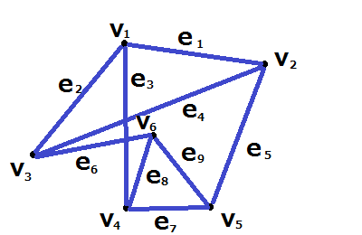

# Graph Thepry
  グラフ理論  
  *あたらしいグラフ理論(小林みどり)*  
  *ISBN978-4-434-17727-9*

## 1. グラフの定義と用語

### 1.1. グラフとは
1つ以上の点と、点を結ぶ線で構成される図。  
線はなくとも構わない。  
  
様々な分野で研究されてきたため、同じものを表す用語がいくつかある。
- 点(point)、頂点(vertex)、結節点(node)...
- 線(line)、辺(edge)、枝(edge)、リンク(link)...

### 1.2. グラフの表記
グラフGは、頂点の集合Vと辺の集合Eの2つで決まり、  
**G=(V,E)**  
と書く。頂点集合Vは有限集合であるが空集合ではないが、辺集合Eは空集合であってもよい。

### 1.3. 隣接と接続
グラフGにおいて頂点v1、v2が辺e1で結ばれている時、つまりe1={v1,v2}である時、頂点v1、v2をe1の**端点**と呼び、v1とv2は**隣接**(adjacent)している。という。

さらに、頂点v1と辺e1は**接続**(incident)している。という。頂点v2と辺e1も接続している。

2辺e1、e2が一つの頂点に接続している時、e1とe2は隣接している。という。

例）  
  
上の図のグラフ**G=(V,E)**において  
**V={v1,v2,v3,v4,v5,v6}**  
**E={e1,e2,e3,e4,e5,e6,e7,e8,e9}**  
  **={{v1,v2},{v1,v3},{v1,v4},{v2,v3},{v2,v5},{v3,v6},{v4,v5},{v4,v6},{v5,v6}}**  
である。

### 1.4. 次数
頂点に接続している辺の本数を、その頂点の**次数**(degree)と呼ぶ。  
頂点vの次数をdeg vと書く。  
次数０の頂点は孤立点と呼ぶ。

#### 定理
**グラフの頂点の次数の総和は、グラフの辺の本数の２倍に等しい。**
  - グラフにおいて、頂点の次数の総和は偶数である。
  - グラフにおいて、次数が奇数である頂点は偶数個ある。

### 1.5. パスとサイクル
- **歩道**  
  グラフにおいて、辺に沿って頂点をたどった時の頂点の並び（列）を**歩道**(walk)という。  
  （例：W=(v1,v2,v3,v6,v4,v5,v2,v3))  
  歩道は、同じ頂点、同じ辺を何度通ってもよく、通る辺の数を、重複も数えて、その歩道の**長さ**と呼ぶ。上記Ｗの長さは７である。  
  歩道には**始点**と**終点**があり、上記Ｗの始点はv1、終点はv3である。  
  歩道は始点から終点までの行き方を表しており、一点からなるW1=(v1)も歩道であり、その長さは０である。

- **パス**（道、path）  
  すべての頂点、辺が異なる歩道のこと。つまり、パスの場合は同じ辺、同じ頂点を通らない。長さkのパスをkパスと呼ぶ。  
  P=(v1,v2,v3,v6,v4,v5)はパスである。  
  始点はv1、終点はv5、長さ５であるから、5パスである。  
  P1=(v1)は長さ０のパスである。

- **サイクル**（閉路、cycle）
  始点と終点が一致し、それ以外の頂点はすべて異なる歩道のこと。長さkのサイクルをk**サイクル**と呼ぶ。サイクルの長さは３以上とし、それ以下はサイクルと呼ばない。  
  C=(v1,v2,v5,v4,v6,v3,v1)  
  長さは６なのでCは６サイクルである。  
  終点は省略してもよい。

  - グラフの**内周**とは、グラフの最小のサイクルの長さのこと。
  - グラフの**外周**とは、グラフの最大のサイクルの長さのこと。
  - サイクルが存在しないグラフについては、内周、外周を定義しない。

### 1.6. 連結グラフ
グラフのどの２頂点についても、その２頂点を結ぶ歩道が存在する時、そのグラフは**連結**である。という。

連結であるグラフを**連結グラフ**といい、連結でないグラフを**非連結グラフ**という。  
非連結グラフGは、いくつかの連結グラフHiにわかれており、HiをGの連結成分と呼ぶ。

### 1.7. ２頂点間の距離
一般に、グラフにおける２頂点u、vの**距離**(distance)とは、uからvへ行くパスのうちの最短パスの長さのことである。  
パスが存在しないとき、２頂点間の距離d(u,v)は、無限大（∞）であるとする。

### 1.8. 切断点（カットポイント）
グラフGのある頂点vを取り去るとGの連結成分の個数が増える時、頂点vを、グラフGの**切断点**（カットポイント）という。  
※頂点を取り去る時、その頂点に接続している辺も同時に取り去る。

### 1.9. 橋（ブリッジ）
グラフGのある辺eを取り去るとGの連結成分の個数が増える時、辺eを、グラフGの**橋**（ブリッジ）という。  
※辺を取り去る時、辺のみを取り、両端点は残しておく
