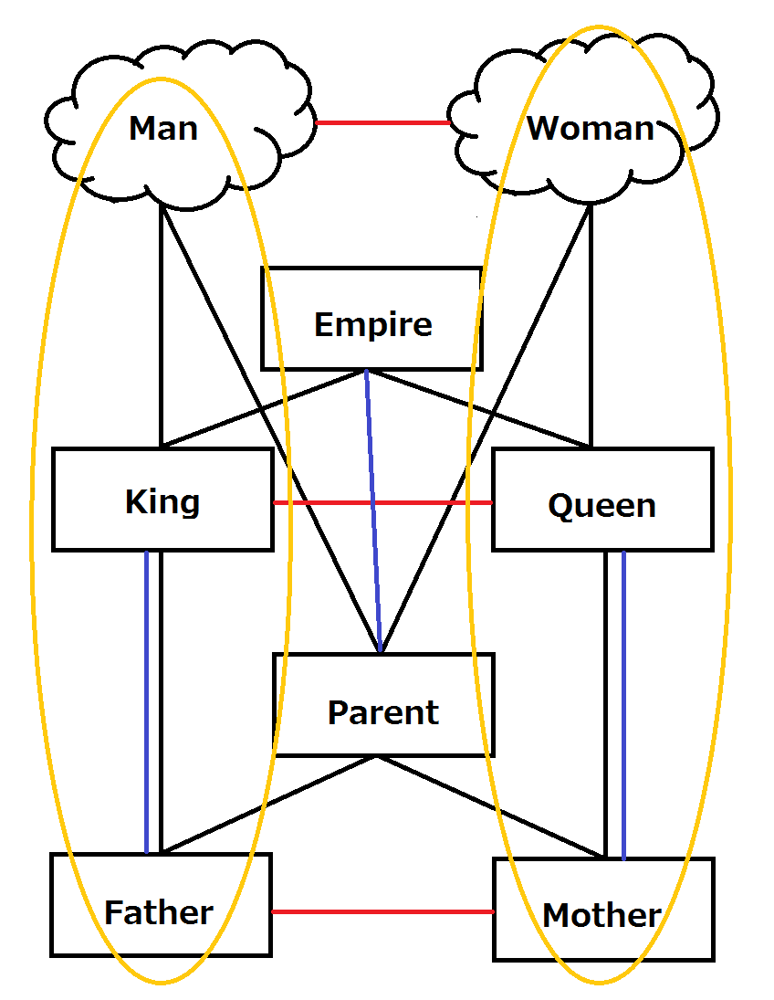
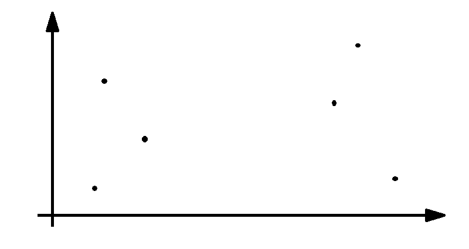
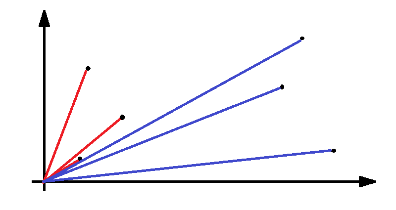
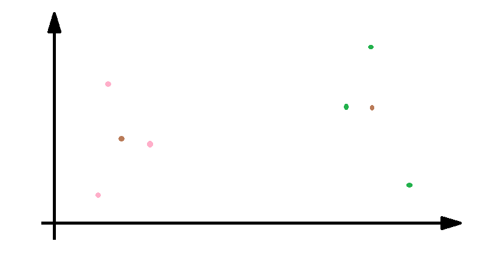
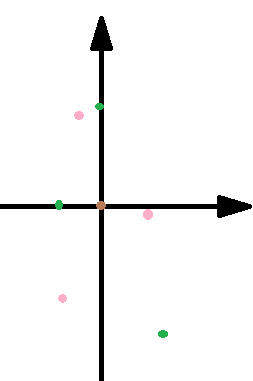
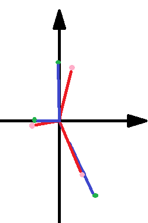

# Meeting Memo

## word2vec
  ### 1. 思想
  周辺単語の予測タスクを解くことで、単語ベクトルを学習している。
  ### 2. なにが見えているか
  - 単語間の共起関係
    - ある単語間の関係性と、別な単語間の関係性を見つけることができる

    

  
    - 対義語は見えない  
      例）好き、嫌い
  - 捉え得る構造
  
    - 黄色いまるで囲んである組、派生に関しては見ることができない  
      → 対象単語を含む記事によくあらわれる単語を、取得し、グループとする。

  #### マッチングの見つけ方
  - 取り出した単語が以下のような位置関係にあるとすると、
  

  - cos類似度をとることを考えると  
  

  - それぞれの重心をとる
  

  - 重心を原点とみなし
  

  - cos類似度を取ることを考える
  

  - 片方のグループに関して、水平軸の正負を反転させると
  

  反転まではできない（個人的な技術・学力不足のため）が、**重心を原点とみなしての正規化はした方が良さそう。**

## 目下何をするか
  1. 同義語、対義語・反対語リストの作成
    - 同義語に関しては高頻出語句を代表語として処理する
    - 処理対象単語の反対語は無視する

  2. 対象単語が含まれる記事によくあらわれる単語を抽出し、それぞれのグループとする

  3. 2.で抽出した単語のグループとグループで重心を原点とする正規化を行う

  4. 別グループとの内積総和行列を作成

  5. ハンガリアン法により最大マッチングを抽出する

  6. 関係性の抽出ができているか確認
    - 例えば、王-王女、爺-婆、兄-姉の関係から、男-女の関係性と、男-女の関係に支配者や老人といった添加要素の抽出までできれば素晴らしい
